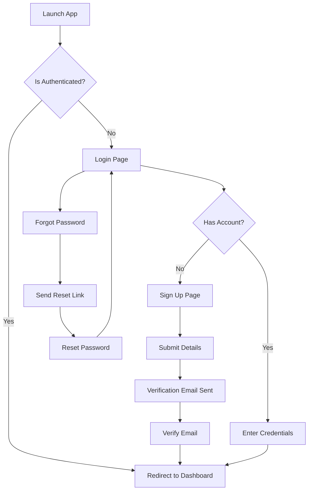
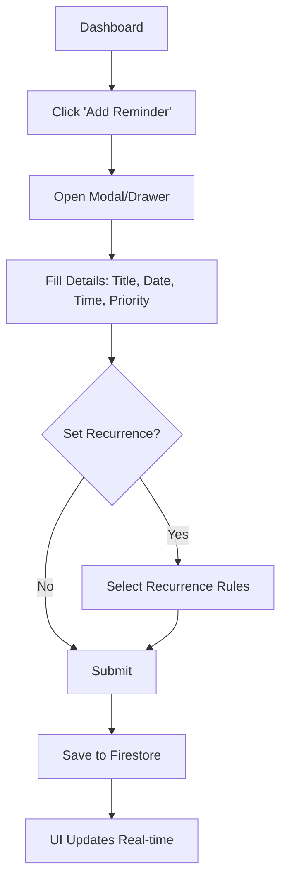
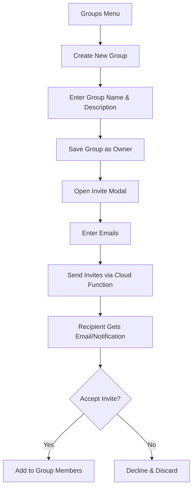
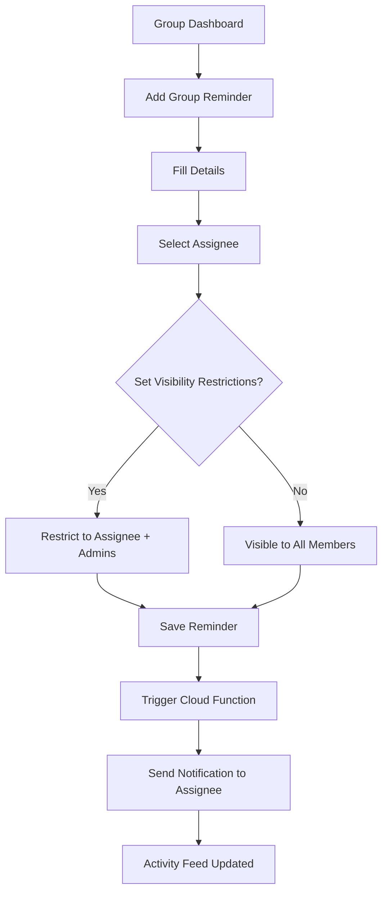
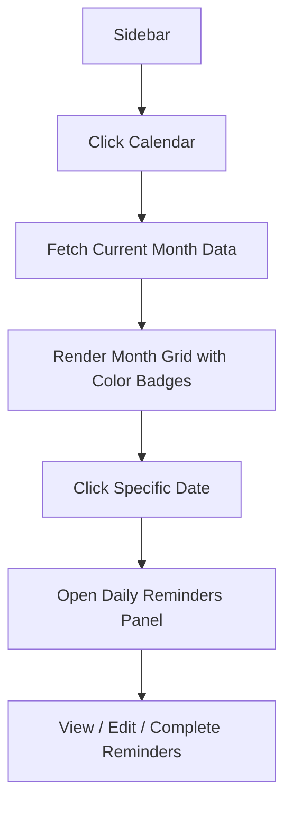

# User Flows

## 1. Authentication Flow

```mermaid
graph TD
    A[Launch App] --> B{Is Authenticated?}
    B -- Yes --> C[Redirect to Dashboard]
    B -- No --> D[Login Page]
    D --> E{Has Account?}
    E -- No --> F[Sign Up Page]
    F --> G[Submit Details]
    G --> H[Verification Email Sent]
    H --> I[Verify Email]
    I --> C
    E -- Yes --> J[Enter Credentials]
    J --> C
    D --> K[Forgot Password]
    K --> L[Send Reset Link]
    L --> M[Reset Password] --> D
```

## 2. Personal Reminder Creation Flow

```mermaid
graph TD
    A[Dashboard] --> B[Click 'Add Reminder']
    B --> C[Open Modal/Drawer]
    C --> D[Fill Details: Title, Date, Time, Priority]
    D --> E{Set Recurrence?}
    E -- Yes --> F[Select Recurrence Rules]
    E -- No --> G
    F --> G[Submit]
    G --> H[Save to Firestore]
    H --> I[UI Updates Real-time]
```

## 3. Group Creation & Invitation Flow

```mermaid
graph TD
    A[Groups Menu] --> B[Create New Group]
    B --> C[Enter Group Name & Description]
    C --> D[Save Group as Owner]
    D --> E[Open Invite Modal]
    E --> F[Enter Emails]
    F --> G[Send Invites via Cloud Function]
    G --> H[Recipient Gets Email/Notification]
    H --> I{Accept Invite?}
    I -- Yes --> J[Add to Group Members]
    I -- No --> K[Decline & Discard]
```

## 4. Shared Reminder Assignment Flow

```mermaid
graph TD
    A[Group Dashboard] --> B[Add Group Reminder]
    B --> C[Fill Details]
    C --> D[Select Assignee]
    D --> E{Set Visibility Restrictions?}
    E -- Yes --> F[Restrict to Assignee + Admins]
    E -- No --> G[Visible to All Members]
    F --> H
    G --> H[Save Reminder]
    H --> I[Trigger Cloud Function]
    I --> J[Send Notification to Assignee]
    J --> K[Activity Feed Updated]
```

## 5. Calendar Navigation Flow

```mermaid
graph TD
    A[Sidebar] --> B[Click Calendar]
    B --> C[Fetch Current Month Data]
    C --> D[Render Month Grid with Color Badges]
    D --> E[Click Specific Date]
    E --> F[Open Daily Reminders Panel]
    F --> G[View / Edit / Complete Reminders]
```
